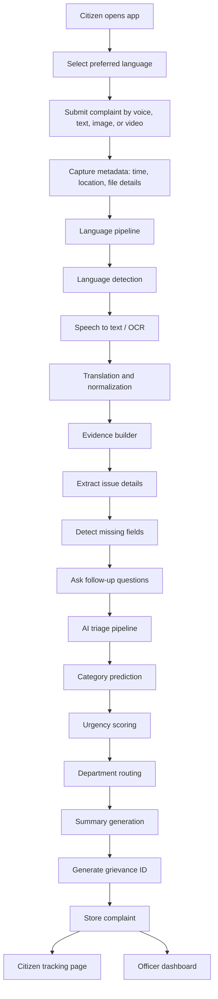

# Multilingual AI-Based Grievance Evidence Builder

An AI-powered multilingual grievance filing and evidence-building platform that helps citizens submit clearer, structured, and department-ready civic complaints using voice, text, images, location, and automated AI assistance. This project is highly relevant to modern grievance redressal because India’s public grievance ecosystem is already moving toward multilingual and multimodal complaint handling through systems such as CPGRAMS and BHASHINI-assisted workflows.

## Problem

Most grievance systems still suffer from vague complaints, language barriers, poor digital accessibility, weak evidence, and incorrect department routing. As a result, citizens face delays and officials spend significant time manually reading, classifying, and re-routing complaints instead of resolving them.

Examples of common failure cases:
- A user writes only “road broken near my area.”
- A complaint has no geolocation or landmark.
- A photo is uploaded, but there is no clear description.
- The complaint is filed in a regional language that the official cannot easily process.
- The issue gets routed to the wrong department and stalls there.

## Solution

This system acts as an AI-assisted complaint builder. Instead of only collecting raw complaints, it helps the user create a strong complaint package by guiding them in their preferred language, extracting evidence, asking smart follow-up questions, scoring completeness, and routing the complaint to the right department.

The end result is a structured grievance packet containing:
- Clean complaint summary
- Original and translated text
- Complaint category
- Urgency score
- Department recommendation
- Evidence completeness score
- Timestamp and geolocation
- Media attachments
- Complaint tracking ID

## Key Features

- Multilingual complaint filing through text or voice input.
- Speech-to-text and translation pipeline for regional languages.
- Evidence collection using photos, timestamps, metadata, and optional map pin or live location.
- AI-based category prediction and department routing.
- Urgency scoring for prioritizing high-impact complaints.
- Evidence completeness scoring to reduce weak submissions.
- Duplicate complaint detection for hotspot clustering and repeated issue tracking.
- Citizen-side complaint status tracking with unique grievance ID.
- Officer dashboard with analytics, heatmaps, trends, and workload views.
- Explainable AI output such as “why routed here” and confidence indicators.

## Why this project matters

This project improves access to public services for rural users, low-digital-literacy users, and people who are more comfortable speaking in local languages. It also reduces triage burden on officials by turning raw user input into structured, actionable complaint files.

From an engineering perspective, it combines full-stack development, multilingual NLP, speech processing, explainable AI, workflow automation, and dashboard analytics in one deployable product. That makes it a strong hackathon, SIH, and portfolio project.

## Target Users

- Citizens in rural and urban areas.
- Migrant workers and regional-language speakers.
- Municipal corporations and civic departments.
- Government officers and administrators who manage complaint triage and resolution.

## Project Flow



## Architecture

### Frontend
- React + Vite
- Tailwind CSS
- React Router
- Axios
- Leaflet or Mapbox
- Recharts / ECharts

### Backend
- FastAPI
- Uvicorn
- Pydantic
- SQLAlchemy
- Alembic
- JWT authentication
- Background jobs for AI tasks

### Database and Infra
- PostgreSQL
- Redis
- S3 / MinIO / Cloudinary for media storage
- Optional pgvector for semantic similarity search

### AI/ML Stack
- Whisper or Indic ASR for speech-to-text
- IndicTrans2 / NLLB / BHASHINI-compatible translation path
- IndicBERT / XLM-R / mBERT for multilingual classification
- SentenceTransformers for duplicate complaint matching
- EasyOCR / Tesseract for OCR
- Lightweight summarizer for officer notes
- Rules + ML hybrid department router
  
## Core Modules

### 1. Citizen Intake Module
Handles multilingual complaint input through text, voice, and media.

### 2. Language Intelligence Module
Performs language detection, transcription, translation, and normalization.

### 3. Evidence Builder Module
Collects structured details, extracts metadata, and improves complaint quality through follow-up prompts.

### 4. AI Triage Module
Predicts complaint category, urgency, and department destination.

### 5. Workflow and Tracking Module
Creates grievance IDs, stores case history, and enables citizen tracking.

### 6. Officer Dashboard Module
Provides filtering, heatmaps, resolution metrics, and status management.

## MVP Scope

For a practical first version, the MVP should include:
- English, Hindi, and Bengali support
- Voice or text complaint filing
- Photo upload
- Map pin or location capture
- Complaint category classifier for 6 civic categories
- Urgency score
- Evidence completeness score
- Unique grievance ID generation
- Complaint tracking page
- Officer dashboard with filters and basic analytics

## Folder Structure

```bash
grievance-ai/
├── backend/
│   ├── app/
│   │   ├── api/
│   │   ├── models/
│   │   ├── schemas/
│   │   ├── services/
│   │   ├── ml/
│   │   └── utils/
│   ├── tests/
│   └── requirements.txt
├── frontend/
│   ├── src/
│   ├── public/
│   └── package.json
├── data/
│   ├── raw/
│   └── processed/
├── notebooks/
├── docs/
└── README.md
```

## Team Split

### Person 1: AI + Backend
- FastAPI APIs
- Database schema
- STT and translation pipeline
- Classification and routing models
- Evidence scoring
- Duplicate detection
- Evaluation metrics

### Person 2: Frontend + Dashboard
- Citizen filing UI
- Complaint tracking UI
- Officer dashboard
- Maps and analytics
- Responsive UX
- Integration and demo polish

### Shared
- Dataset creation
- Integration testing
- Deployment
- Documentation
- Presentation and demo script

## Dataset Plan

Since real government complaint data may be limited, the initial dataset can be built using synthetic and manually labeled examples. Each sample should include language, complaint text, translated text, category, urgency, department, evidence quality, and optional location metadata.

Suggested categories:
- Water supply
- Drainage
- Road damage
- Garbage overflow
- Streetlight failure
- Electricity fault
- Public sanitation

## Success Metrics

- Complaint classification accuracy / macro F1
- Routing accuracy
- High-priority precision for urgency detection
- Evidence completeness improvement
- Duplicate complaint detection precision
- Average complaint filing time
- Officer triage time reduction
- Complaint resolution time reduction in simulation

## Risks and Mitigations

| Risk | Mitigation |
|---|---|
| Limited real data | Use synthetic and manually labeled data |
| Translation errors | Limit MVP to 2 to 3 languages first |
| Wrong routing | Use hybrid rules + ML routing |
| Heavy models on CPU laptop | Use lightweight models and offline batching |
| Missing geotag in uploaded photos | Ask for map pin or live location fallback |
| Scope becoming too large | Keep video understanding optional |

## Future Improvements

- More Indian languages
- Video-based issue analysis
- Better summarization with lightweight LLMs
- SLA breach prediction
- Complaint trend forecasting
- Citizen feedback sentiment analysis
- Auto-escalation engine
- Integration with real grievance portals and SMS alerts

## Local Setup

### Backend
```bash
cd backend
python -m venv venv
source venv/bin/activate   # or venv\Scripts\activate on Windows
pip install -r requirements.txt
uvicorn app.main:app --reload
```

### Frontend
```bash
cd frontend
npm install
npm run dev
```

## Demo Story

A citizen selects a language, speaks or types a complaint, uploads a photo, and shares a location pin. The AI converts that into a structured complaint, asks for any missing information, assigns the likely department, generates a grievance ID, and shows the complaint in an officer dashboard with urgency and evidence scores.
